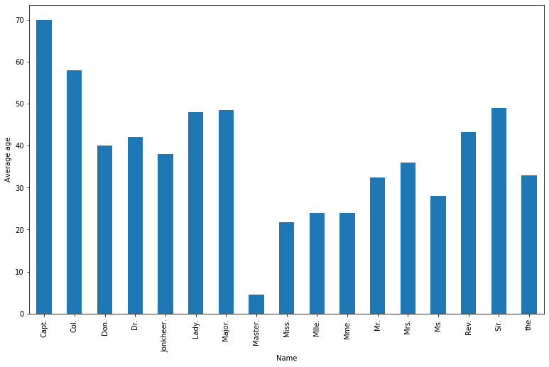
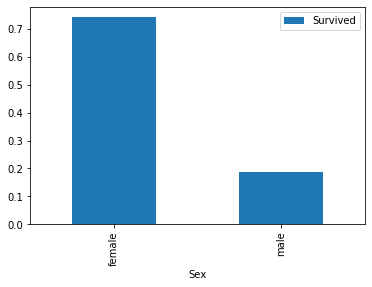
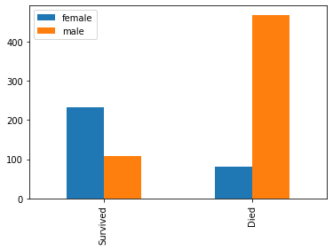
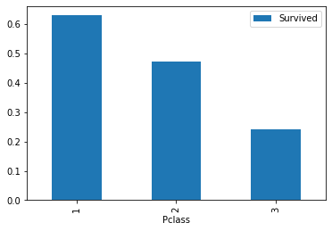
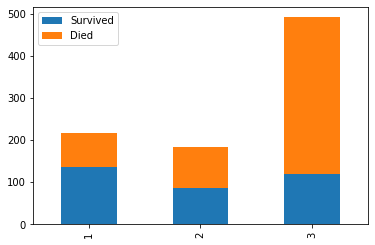
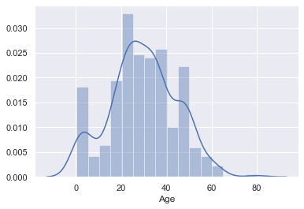
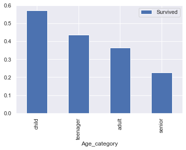
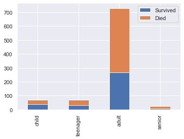

# Titanic - predictive Analytics
by Anja Ertlschweiger, Michael Neuböck, Julia Putz | ITM18

Goal: Predict what sort of people were likely to survive


### Structure of our Notebook:
1. import necessary libraries
2. Data retrieval
3. Data preperation for exploration
4. Data exploration
5. Data preperation for modelling
6. Modelling

## Import libraries

numpy - for mathematical calculations
pandas - to read in input files 
matplotlib - for plotting


```python
import warnings
warnings.simplefilter(action='ignore', category=FutureWarning)

import numpy as np
import pandas as pd
import matplotlib.pyplot as plt
```

## Data retrieval

read in test and training datasets and print them to check if it works


```python
train=pd.read_csv("./input/train.csv")
train
```


<div>
<style scoped>
    .dataframe tbody tr th:only-of-type {
        vertical-align: middle;
    }
</style>

<table border="1" class="dataframe">
  <thead>
    <tr style="text-align: right;">
      <th></th>
      <th>PassengerId</th>
      <th>Survived</th>
      <th>Pclass</th>
      <th>Name</th>
      <th>Sex</th>
      <th>Age</th>
      <th>SibSp</th>
      <th>Parch</th>
      <th>Ticket</th>
      <th>Fare</th>
      <th>Cabin</th>
      <th>Embarked</th>
    </tr>
  </thead>
  <tbody>
    <tr>
      <td>0</td>
      <td>1</td>
      <td>0</td>
      <td>3</td>
      <td>Braund, Mr. Owen Harris</td>
      <td>male</td>
      <td>22.0</td>
      <td>1</td>
      <td>0</td>
      <td>A/5 21171</td>
      <td>7.2500</td>
      <td>NaN</td>
      <td>S</td>
    </tr>
    <tr>
      <td>1</td>
      <td>2</td>
      <td>1</td>
      <td>1</td>
      <td>Cumings, Mrs. John Bradley (Florence Briggs Th...</td>
      <td>female</td>
      <td>38.0</td>
      <td>1</td>
      <td>0</td>
      <td>PC 17599</td>
      <td>71.2833</td>
      <td>C85</td>
      <td>C</td>
    </tr>
    <tr>
      <td>2</td>
      <td>3</td>
      <td>1</td>
      <td>3</td>
      <td>Heikkinen, Miss. Laina</td>
      <td>female</td>
      <td>26.0</td>
      <td>0</td>
      <td>0</td>
      <td>STON/O2. 3101282</td>
      <td>7.9250</td>
      <td>NaN</td>
      <td>S</td>
    </tr>
    <tr>
      <td>3</td>
      <td>4</td>
      <td>1</td>
      <td>1</td>
      <td>Futrelle, Mrs. Jacques Heath (Lily May Peel)</td>
      <td>female</td>
      <td>35.0</td>
      <td>1</td>
      <td>0</td>
      <td>113803</td>
      <td>53.1000</td>
      <td>C123</td>
      <td>S</td>
    </tr>
    <tr>
      <td>...</td>
      <td>...</td>
      <td>...</td>
      <td>...</td>
      <td>...</td>
      <td>...</td>
      <td>...</td>
      <td>...</td>
      <td>...</td>
      <td>...</td>
      <td>...</td>
      <td>...</td>
      <td>...</td>
    </tr>
    <tr>
      <td>888</td>
      <td>889</td>
      <td>0</td>
      <td>3</td>
      <td>Johnston, Miss. Catherine Helen "Carrie"</td>
      <td>female</td>
      <td>NaN</td>
      <td>1</td>
      <td>2</td>
      <td>W./C. 6607</td>
      <td>23.4500</td>
      <td>NaN</td>
      <td>S</td>
    </tr>
    <tr>
      <td>889</td>
      <td>890</td>
      <td>1</td>
      <td>1</td>
      <td>Behr, Mr. Karl Howell</td>
      <td>male</td>
      <td>26.0</td>
      <td>0</td>
      <td>0</td>
      <td>111369</td>
      <td>30.0000</td>
      <td>C148</td>
      <td>C</td>
    </tr>
    <tr>
      <td>890</td>
      <td>891</td>
      <td>0</td>
      <td>3</td>
      <td>Dooley, Mr. Patrick</td>
      <td>male</td>
      <td>32.0</td>
      <td>0</td>
      <td>0</td>
      <td>370376</td>
      <td>7.7500</td>
      <td>NaN</td>
      <td>Q</td>
    </tr>
  </tbody>
</table>
<p>891 rows × 12 columns</p>

</div>


```python
test=pd.read_csv("./input/test.csv")
test
```


<div>
<style scoped>
    .dataframe tbody tr th:only-of-type {
        vertical-align: middle;
    }
</style>

<table border="1" class="dataframe">
  <thead>
    <tr style="text-align: right;">
      <th></th>
      <th>PassengerId</th>
      <th>Pclass</th>
      <th>Name</th>
      <th>Sex</th>
      <th>Age</th>
      <th>SibSp</th>
      <th>Parch</th>
      <th>Ticket</th>
      <th>Fare</th>
      <th>Cabin</th>
      <th>Embarked</th>
    </tr>
  </thead>
  <tbody>
    <tr>
      <td>0</td>
      <td>892</td>
      <td>3</td>
      <td>Kelly, Mr. James</td>
      <td>male</td>
      <td>34.5</td>
      <td>0</td>
      <td>0</td>
      <td>330911</td>
      <td>7.8292</td>
      <td>NaN</td>
      <td>Q</td>
    </tr>
    <tr>
      <td>1</td>
      <td>893</td>
      <td>3</td>
      <td>Wilkes, Mrs. James (Ellen Needs)</td>
      <td>female</td>
      <td>47.0</td>
      <td>1</td>
      <td>0</td>
      <td>363272</td>
      <td>7.0000</td>
      <td>NaN</td>
      <td>S</td>
    </tr>
    <tr>
      <td>2</td>
      <td>894</td>
      <td>2</td>
      <td>Myles, Mr. Thomas Francis</td>
      <td>male</td>
      <td>62.0</td>
      <td>0</td>
      <td>0</td>
      <td>240276</td>
      <td>9.6875</td>
      <td>NaN</td>
      <td>Q</td>
    </tr>
    <tr>
      <td>3</td>
      <td>895</td>
      <td>3</td>
      <td>Wirz, Mr. Albert</td>
      <td>male</td>
      <td>27.0</td>
      <td>0</td>
      <td>0</td>
      <td>315154</td>
      <td>8.6625</td>
      <td>NaN</td>
      <td>S</td>
    </tr>
    <tr>
      <td>4</td>
      <td>896</td>
      <td>3</td>
      <td>Hirvonen, Mrs. Alexander (Helga E Lindqvist)</td>
      <td>female</td>
      <td>22.0</td>
      <td>1</td>
      <td>1</td>
      <td>3101298</td>
      <td>12.2875</td>
      <td>NaN</td>
      <td>S</td>
    </tr>
    <tr>
      <td>...</td>
      <td>...</td>
      <td>...</td>
      <td>...</td>
      <td>...</td>
      <td>...</td>
      <td>...</td>
      <td>...</td>
      <td>...</td>
      <td>...</td>
      <td>...</td>
      <td>...</td>
    </tr>
    <tr>
      <td>413</td>
      <td>1305</td>
      <td>3</td>
      <td>Spector, Mr. Woolf</td>
      <td>male</td>
      <td>NaN</td>
      <td>0</td>
      <td>0</td>
      <td>A.5. 3236</td>
      <td>8.0500</td>
      <td>NaN</td>
      <td>S</td>
    </tr>
    <tr>
      <td>414</td>
      <td>1306</td>
      <td>1</td>
      <td>Oliva y Ocana, Dona. Fermina</td>
      <td>female</td>
      <td>39.0</td>
      <td>0</td>
      <td>0</td>
      <td>PC 17758</td>
      <td>108.9000</td>
      <td>C105</td>
      <td>C</td>
    </tr>
    <tr>
      <td>415</td>
      <td>1307</td>
      <td>3</td>
      <td>Saether, Mr. Simon Sivertsen</td>
      <td>male</td>
      <td>38.5</td>
      <td>0</td>
      <td>0</td>
      <td>SOTON/O.Q. 3101262</td>
      <td>7.2500</td>
      <td>NaN</td>
      <td>S</td>
    </tr>
    <tr>
      <td>416</td>
      <td>1308</td>
      <td>3</td>
      <td>Ware, Mr. Frederick</td>
      <td>male</td>
      <td>NaN</td>
      <td>0</td>
      <td>0</td>
      <td>359309</td>
      <td>8.0500</td>
      <td>NaN</td>
      <td>S</td>
    </tr>
    <tr>
      <td>417</td>
      <td>1309</td>
      <td>3</td>
      <td>Peter, Master. Michael J</td>
      <td>male</td>
      <td>NaN</td>
      <td>1</td>
      <td>1</td>
      <td>2668</td>
      <td>22.3583</td>
      <td>NaN</td>
      <td>C</td>
    </tr>
  </tbody>
</table>
<p>418 rows × 11 columns</p>
</div>


## Data preperation for exploration

Delete unnecessary features which have no impact on further calculations or visualizations. Therefore we use axis=1 (use 1 to delete the column, 0 to delete the row) to delete the whole column and inplace=True to replace the whole table. Check if the changes worked.


```python
train.drop(["SibSp", "Parch", "Ticket", "Fare", "Cabin"], axis=1, inplace=True)
test.drop(["SibSp", "Parch", "Ticket", "Fare", "Cabin"], axis=1, inplace=True)
train
```


<div>
<style scoped>
    .dataframe tbody tr th:only-of-type {
        vertical-align: middle;
    }
</style>

<table border="1" class="dataframe">
  <thead>
    <tr style="text-align: right;">
      <th></th>
      <th>PassengerId</th>
      <th>Survived</th>
      <th>Pclass</th>
      <th>Name</th>
      <th>Sex</th>
      <th>Age</th>
      <th>Embarked</th>
    </tr>
  </thead>
  <tbody>
    <tr>
      <td>0</td>
      <td>1</td>
      <td>0</td>
      <td>3</td>
      <td>Braund, Mr. Owen Harris</td>
      <td>male</td>
      <td>22.0</td>
      <td>S</td>
    </tr>
    <tr>
      <td>1</td>
      <td>2</td>
      <td>1</td>
      <td>1</td>
      <td>Cumings, Mrs. John Bradley (Florence Briggs Th...</td>
      <td>female</td>
      <td>38.0</td>
      <td>C</td>
    </tr>
    <tr>
      <td>2</td>
      <td>3</td>
      <td>1</td>
      <td>3</td>
      <td>Heikkinen, Miss. Laina</td>
      <td>female</td>
      <td>26.0</td>
      <td>S</td>
    </tr>
    <tr>
      <td>3</td>
      <td>4</td>
      <td>1</td>
      <td>1</td>
      <td>Futrelle, Mrs. Jacques Heath (Lily May Peel)</td>
      <td>female</td>
      <td>35.0</td>
      <td>S</td>
    </tr>
    <tr>
      <td>4</td>
      <td>5</td>
      <td>0</td>
      <td>3</td>
      <td>Allen, Mr. William Henry</td>
      <td>male</td>
      <td>35.0</td>
      <td>S</td>
    </tr>
    <tr>
      <td>...</td>
      <td>...</td>
      <td>...</td>
      <td>...</td>
      <td>...</td>
      <td>...</td>
      <td>...</td>
      <td>...</td>
    </tr>
    <tr>
      <td>886</td>
      <td>887</td>
      <td>0</td>
      <td>2</td>
      <td>Montvila, Rev. Juozas</td>
      <td>male</td>
      <td>27.0</td>
      <td>S</td>
    </tr>
    <tr>
      <td>887</td>
      <td>888</td>
      <td>1</td>
      <td>1</td>
      <td>Graham, Miss. Margaret Edith</td>
      <td>female</td>
      <td>19.0</td>
      <td>S</td>
    </tr>
    <tr>
      <td>888</td>
      <td>889</td>
      <td>0</td>
      <td>3</td>
      <td>Johnston, Miss. Catherine Helen "Carrie"</td>
      <td>female</td>
      <td>NaN</td>
      <td>S</td>
    </tr>
    <tr>
      <td>889</td>
      <td>890</td>
      <td>1</td>
      <td>1</td>
      <td>Behr, Mr. Karl Howell</td>
      <td>male</td>
      <td>26.0</td>
      <td>C</td>
    </tr>
    <tr>
      <td>890</td>
      <td>891</td>
      <td>0</td>
      <td>3</td>
      <td>Dooley, Mr. Patrick</td>
      <td>male</td>
      <td>32.0</td>
      <td>Q</td>
    </tr>
  </tbody>
</table>
<p>891 rows × 7 columns</p>
</div>


In the printed table above you can see that there are entries which have null values in the age column. So we are checking how often that's the case.


```python
print("Number of null values in Age:", sum(train.Age.isnull()))
```

    Number of null values in Age: 177

As 177 is such a large number, we can't just ignore that or simply delete those entries. It would have a negative impact on our results and falsify our calculations. That is why we are filtering the names of the passengers and replace them with only their titles. We do that for both of our datasets. For each title we are calculating the average age which we plot as a bar chart.


```python
got = train.Name.str.split(',').str[1]
train.iloc[:,3]=pd.DataFrame(got).Name.str.split('\s+').str[1]

got_test = test.Name.str.split(',').str[1]
test.iloc[:,2]=pd.DataFrame(got_test).Name.str.split('\s+').str[1]

ax = plt.subplot()
ax.set_ylabel("Average age")
train.groupby("Name").mean()["Age"].plot(kind="bar",figsize=(13,8), ax=ax)
```


    <matplotlib.axes._subplots.AxesSubplot at 0x224cc65b648>





```python
title_mean_age=[]
title_mean_age.append(list(set(train.Name)))
title_mean_age.append(train.groupby("Name").Age.mean())

title_mean_age.append(list(set(test.Name)))
title_mean_age.append(test.groupby("Name").Age.mean())
```


Next up we are going through the whole dataset and look for the entries which have a null value in their age column. If we find one we replace the null value with the average age of the related title.


```python
n_training = train.shape[0]
n_titles = len(title_mean_age[1])
for i in range(0, n_training):
    if np.isnan(train.Age[i])==True:
        for j in range(0, n_titles):
            if train.Name[i] == title_mean_age[0][j]:
                train.Age[i] = title_mean_age[1][j]
                
n_testing = test.shape[0]
n_titles = len(title_mean_age[1])
for i in range(0, n_testing):
    if np.isnan(test.Age[i])==True:
        for j in range(0, n_titles):
            if test.Name[i] == title_mean_age[0][j]:
                test.Age[i] = title_mean_age[1][j]
```


```python
print("Number of null values in Age:", sum(train.Age.isnull()))
```

    Number of null values in Age: 0

Now there are no more null values in the age column, so we don't need the name feature anymore and delete it.


```python
train.drop(["Name"], axis=1, inplace=True)
test.drop(["Name"], axis=1, inplace=True)
train
```


<div>
<style scoped>
    .dataframe tbody tr th:only-of-type {
        vertical-align: middle;
    }
</style>

<table border="1" class="dataframe">
  <thead>
    <tr style="text-align: right;">
      <th></th>
      <th>PassengerId</th>
      <th>Survived</th>
      <th>Pclass</th>
      <th>Sex</th>
      <th>Age</th>
      <th>Embarked</th>
    </tr>
  </thead>
  <tbody>
    <tr>
      <td>0</td>
      <td>1</td>
      <td>0</td>
      <td>3</td>
      <td>male</td>
      <td>22.0</td>
      <td>S</td>
    </tr>
    <tr>
      <td>1</td>
      <td>2</td>
      <td>1</td>
      <td>1</td>
      <td>female</td>
      <td>38.0</td>
      <td>C</td>
    </tr>
    <tr>
      <td>2</td>
      <td>3</td>
      <td>1</td>
      <td>3</td>
      <td>female</td>
      <td>26.0</td>
      <td>S</td>
    </tr>
    <tr>
      <td>3</td>
      <td>4</td>
      <td>1</td>
      <td>1</td>
      <td>female</td>
      <td>35.0</td>
      <td>S</td>
    </tr>
    <tr>
      <td>4</td>
      <td>5</td>
      <td>0</td>
      <td>3</td>
      <td>male</td>
      <td>35.0</td>
      <td>S</td>
    </tr>
    <tr>
      <td>...</td>
      <td>...</td>
      <td>...</td>
      <td>...</td>
      <td>...</td>
      <td>...</td>
      <td>...</td>
    </tr>
    <tr>
      <td>886</td>
      <td>887</td>
      <td>0</td>
      <td>2</td>
      <td>male</td>
      <td>27.0</td>
      <td>S</td>
    </tr>
    <tr>
      <td>887</td>
      <td>888</td>
      <td>1</td>
      <td>1</td>
      <td>female</td>
      <td>19.0</td>
      <td>S</td>
    </tr>
    <tr>
      <td>888</td>
      <td>889</td>
      <td>0</td>
      <td>3</td>
      <td>female</td>
      <td>48.0</td>
      <td>S</td>
    </tr>
    <tr>
      <td>889</td>
      <td>890</td>
      <td>1</td>
      <td>1</td>
      <td>male</td>
      <td>26.0</td>
      <td>C</td>
    </tr>
    <tr>
      <td>890</td>
      <td>891</td>
      <td>0</td>
      <td>3</td>
      <td>male</td>
      <td>32.0</td>
      <td>Q</td>
    </tr>
  </tbody>
</table>
<p>891 rows × 6 columns</p>
</div>


For further calculation and visualization we are adding the feature "Age_category" to our datesets. Therefore we are defining our cut points, to set from what age a category should start and end, and our label_names, which define how the categories should be named. Here it is important that the cut_points array contains one more value than the label_names array. The function we are defining next, adds a new feature to the input dataset. It checks which category the age belongs to and adds the correct category. Now the function only has to be called for the two of our datasets.


```python
cut_points = [0, 11, 18, 60, 100]
label_names = ["child", "teenager", "adult", "senior"]
```


```python
def process_age(df, cut_points, label_names):
    df["Age_category"] = pd.cut(df["Age"],cut_points,labels=label_names)
    return df
train = process_age(train,cut_points,label_names)
test = process_age(test,cut_points,label_names)
train
```


<div>
<style scoped>
    .dataframe tbody tr th:only-of-type {
        vertical-align: middle;
    }
</style>

<table border="1" class="dataframe">
  <thead>
    <tr style="text-align: right;">
      <th></th>
      <th>PassengerId</th>
      <th>Survived</th>
      <th>Pclass</th>
      <th>Sex</th>
      <th>Age</th>
      <th>Embarked</th>
      <th>Age_category</th>
    </tr>
  </thead>
  <tbody>
    <tr>
      <td>0</td>
      <td>1</td>
      <td>0</td>
      <td>3</td>
      <td>male</td>
      <td>22.0</td>
      <td>S</td>
      <td>adult</td>
    </tr>
    <tr>
      <td>1</td>
      <td>2</td>
      <td>1</td>
      <td>1</td>
      <td>female</td>
      <td>38.0</td>
      <td>C</td>
      <td>adult</td>
    </tr>
    <tr>
      <td>2</td>
      <td>3</td>
      <td>1</td>
      <td>3</td>
      <td>female</td>
      <td>26.0</td>
      <td>S</td>
      <td>adult</td>
    </tr>
    <tr>
      <td>3</td>
      <td>4</td>
      <td>1</td>
      <td>1</td>
      <td>female</td>
      <td>35.0</td>
      <td>S</td>
      <td>adult</td>
    </tr>
    <tr>
      <td>4</td>
      <td>5</td>
      <td>0</td>
      <td>3</td>
      <td>male</td>
      <td>35.0</td>
      <td>S</td>
      <td>adult</td>
    </tr>
    <tr>
      <td>...</td>
      <td>...</td>
      <td>...</td>
      <td>...</td>
      <td>...</td>
      <td>...</td>
      <td>...</td>
      <td>...</td>
    </tr>
    <tr>
      <td>886</td>
      <td>887</td>
      <td>0</td>
      <td>2</td>
      <td>male</td>
      <td>27.0</td>
      <td>S</td>
      <td>adult</td>
    </tr>
    <tr>
      <td>887</td>
      <td>888</td>
      <td>1</td>
      <td>1</td>
      <td>female</td>
      <td>19.0</td>
      <td>S</td>
      <td>adult</td>
    </tr>
    <tr>
      <td>888</td>
      <td>889</td>
      <td>0</td>
      <td>3</td>
      <td>female</td>
      <td>48.0</td>
      <td>S</td>
      <td>adult</td>
    </tr>
    <tr>
      <td>889</td>
      <td>890</td>
      <td>1</td>
      <td>1</td>
      <td>male</td>
      <td>26.0</td>
      <td>C</td>
      <td>adult</td>
    </tr>
    <tr>
      <td>890</td>
      <td>891</td>
      <td>0</td>
      <td>3</td>
      <td>male</td>
      <td>32.0</td>
      <td>Q</td>
      <td>adult</td>
    </tr>
  </tbody>
</table>
<p>891 rows × 7 columns</p>
</div>

After this cleaning and categorizing part our dataset is ready to be analyzed by us.


## Data exploration

The first passengers who were allowed to board the lifeboats were women and children who travelled first-class. Next passengers from second and in the end those from third class were rescued. Based on these facts we already had some assumptions about who was likely to survive. So we checked the dataset if we can find entries which confirm our assumptions. 


#### Comparison how many women/men survived

According to the data over 70% of the women and only about 18% of the men who were on Board survived (Plot 1). That is due to the fact that women were rescued before men. Furthermore there were way more men on Board than women, hence it is even more shocking that in the end more than twice as many women survived (Plot 2).


```python
sex_pivot = train.pivot_table(index="Sex", values="Survived")
sex_pivot
```


<div>
<style scoped>
    .dataframe tbody tr th:only-of-type {
        vertical-align: middle;
    }
</style>

<table border="1" class="dataframe">
  <thead>
    <tr style="text-align: right;">
      <th></th>
      <th>Survived</th>
    </tr>
    <tr>
      <th>Sex</th>
      <th></th>
    </tr>
  </thead>
  <tbody>
    <tr>
      <td>female</td>
      <td>0.742038</td>
    </tr>
    <tr>
      <td>male</td>
      <td>0.188908</td>
    </tr>
  </tbody>
</table>
</div>


```python
sex_pivot.plot.bar()
plt.show()
```





```python
survived_sex = train[train["Survived"]==1]["Sex"].value_counts()
dead_sex = train[train["Survived"]==0]["Sex"].value_counts()
df_sex = pd.DataFrame([survived_sex,dead_sex])
df_sex.index = ["Survived", "Died"]
df_sex
```


<div>
<style scoped>
    .dataframe tbody tr th:only-of-type {
        vertical-align: middle;
    }
</style>

<table border="1" class="dataframe">
  <thead>
    <tr style="text-align: right;">
      <th></th>
      <th>female</th>
      <th>male</th>
    </tr>
  </thead>
  <tbody>
    <tr>
      <td>Survived</td>
      <td>233</td>
      <td>109</td>
    </tr>
    <tr>
      <td>Died</td>
      <td>81</td>
      <td>468</td>
    </tr>
  </tbody>
</table>
</div>


```python
df_sex.plot.bar()
plt.show()
```





#### Comparison how many 1/2/3 class passengers survived

The following plot visualizes, that passengers who travelled first class had the biggest chance to survive. There were only few second class passengers on board, that is why such a high percentage survived. But if you compare the concrete numbers of survivors per class, they had the fewest. Most casualties were passengers from third class. Although most passengers on Board travelled third class, they had less survivors than the first class. This may sound frightening but can again be explained with the fact that first class passengers were rescued first.


```python
pclass_pivot = train.pivot_table(index="Pclass", values="Survived")
pclass_pivot
```


<div>
<style scoped>
    .dataframe tbody tr th:only-of-type {
        vertical-align: middle;
    }
</style>

<table border="1" class="dataframe">
  <thead>
    <tr style="text-align: right;">
      <th></th>
      <th>Survived</th>
    </tr>
    <tr>
      <th>Pclass</th>
      <th></th>
    </tr>
  </thead>
  <tbody>
    <tr>
      <td>1</td>
      <td>0.629630</td>
    </tr>
    <tr>
      <td>2</td>
      <td>0.472826</td>
    </tr>
    <tr>
      <td>3</td>
      <td>0.242363</td>
    </tr>
  </tbody>
</table>
</div>


```python
pclass_pivot.plot.bar()
plt.show()
```





```python
survived_class = train[train["Survived"]==1]["Pclass"].value_counts()
dead_class = train[train["Survived"]==0]["Pclass"].value_counts()
df_class = pd.DataFrame([survived_class,dead_class])
df_class.index = ["Survived", "Died"]

df_class
```


<div>
<style scoped>
    .dataframe tbody tr th:only-of-type {
        vertical-align: middle;
    }
</style>

<table border="1" class="dataframe">
  <thead>
    <tr style="text-align: right;">
      <th></th>
      <th>1</th>
      <th>2</th>
      <th>3</th>
    </tr>
  </thead>
  <tbody>
    <tr>
      <td>Survived</td>
      <td>136</td>
      <td>87</td>
      <td>119</td>
    </tr>
    <tr>
      <td>Died</td>
      <td>80</td>
      <td>97</td>
      <td>372</td>
    </tr>
  </tbody>
</table>
</div>


```python
df_class.T.plot(kind="bar", stacked=True)
plt.show()
```





#### Analysis of Survivors according to their age

The first graph illustrates that most survivors were between 20 and 40 years old. However children had the biggest chance to survive. The survival rate decreases with increasing age. Since mostly adults were on Board, most of the survivors are adults as well. Except for the children, in each category less than 50% survived. At this point you can clearly see that children were among the first ones who got rescued.


```python
import seaborn as sns
sns.set()
bool_frame = train["Survived"]==1
sns.distplot(train[bool_frame]["Age"])
plt.show()
```





```python
age_pivot = train.pivot_table(index="Age_category", values="Survived")
age_pivot
```


<div>
<style scoped>
    .dataframe tbody tr th:only-of-type {
        vertical-align: middle;
    }
</style>

<table border="1" class="dataframe">
  <thead>
    <tr style="text-align: right;">
      <th></th>
      <th>Survived</th>
    </tr>
    <tr>
      <th>Age_category</th>
      <th></th>
    </tr>
  </thead>
  <tbody>
    <tr>
      <td>child</td>
      <td>0.573529</td>
    </tr>
    <tr>
      <td>teenager</td>
      <td>0.436620</td>
    </tr>
    <tr>
      <td>adult</td>
      <td>0.365753</td>
    </tr>
    <tr>
      <td>senior</td>
      <td>0.227273</td>
    </tr>
  </tbody>
</table>
</div>


```python
age_pivot.plot.bar()
plt.show()
```





```python
survived_age = train[train["Survived"]==1]["Age_category"].value_counts()
dead_age = train[train["Survived"]==0]["Age_category"].value_counts()
df_age = pd.DataFrame([survived_age,dead_age])
df_age.index = ["Survived", "Died"]

df_age
```


<div>
<style scoped>
    .dataframe tbody tr th:only-of-type {
        vertical-align: middle;
    }
</style>

<table border="1" class="dataframe">
  <thead>
    <tr style="text-align: right;">
      <th></th>
      <th>child</th>
      <th>teenager</th>
      <th>adult</th>
      <th>senior</th>
    </tr>
  </thead>
  <tbody>
    <tr>
      <td>Survived</td>
      <td>39</td>
      <td>31</td>
      <td>267</td>
      <td>5</td>
    </tr>
    <tr>
      <td>Died</td>
      <td>29</td>
      <td>40</td>
      <td>463</td>
      <td>17</td>
    </tr>
  </tbody>
</table>
</div>


```python
df_age.T.plot(kind="bar", stacked=True)
plt.show()
```




## Data preperation for modelling
As the preperation we did earlier was aimed to analyze the data precisely, we still have to prepare the datasets for modelling. The Models we are using cannot handle strings as entries, therefore we need to convert them into int or float values. This changes must be done in the Age_category, Sex and Embarked column.


```python
age_mapping = {"child": 1, "teenager": 2, "adult": 3, "senior": 4}
train["Age_category"] = train["Age_category"].map(age_mapping)
test["Age_category"] = test["Age_category"].map(age_mapping)

train.head()
```


<div>
<style scoped>
    .dataframe tbody tr th:only-of-type {
        vertical-align: middle;
    }
</style>

<table border="1" class="dataframe">
  <thead>
    <tr style="text-align: right;">
      <th></th>
      <th>PassengerId</th>
      <th>Survived</th>
      <th>Pclass</th>
      <th>Sex</th>
      <th>Age</th>
      <th>Embarked</th>
      <th>Age_category</th>
    </tr>
  </thead>
  <tbody>
    <tr>
      <td>0</td>
      <td>1</td>
      <td>0</td>
      <td>3</td>
      <td>male</td>
      <td>22.0</td>
      <td>S</td>
      <td>3</td>
    </tr>
    <tr>
      <td>1</td>
      <td>2</td>
      <td>1</td>
      <td>1</td>
      <td>female</td>
      <td>38.0</td>
      <td>C</td>
      <td>3</td>
    </tr>
    <tr>
      <td>2</td>
      <td>3</td>
      <td>1</td>
      <td>3</td>
      <td>female</td>
      <td>26.0</td>
      <td>S</td>
      <td>3</td>
    </tr>
    <tr>
      <td>3</td>
      <td>4</td>
      <td>1</td>
      <td>1</td>
      <td>female</td>
      <td>35.0</td>
      <td>S</td>
      <td>3</td>
    </tr>
    <tr>
      <td>4</td>
      <td>5</td>
      <td>0</td>
      <td>3</td>
      <td>male</td>
      <td>35.0</td>
      <td>S</td>
      <td>3</td>
    </tr>
  </tbody>
</table>
</div>


```python
sex_mapping = {"male": 0, "female": 1}
train['Sex'] = train['Sex'].map(sex_mapping)
test['Sex'] = test['Sex'].map(sex_mapping)

train.head()
```


<div>
<style scoped>
    .dataframe tbody tr th:only-of-type {
        vertical-align: middle;
    }
</style>

<table border="1" class="dataframe">
  <thead>
    <tr style="text-align: right;">
      <th></th>
      <th>PassengerId</th>
      <th>Survived</th>
      <th>Pclass</th>
      <th>Sex</th>
      <th>Age</th>
      <th>Embarked</th>
      <th>Age_category</th>
    </tr>
  </thead>
  <tbody>
    <tr>
      <td>0</td>
      <td>1</td>
      <td>0</td>
      <td>3</td>
      <td>0</td>
      <td>22.0</td>
      <td>S</td>
      <td>3</td>
    </tr>
    <tr>
      <td>1</td>
      <td>2</td>
      <td>1</td>
      <td>1</td>
      <td>1</td>
      <td>38.0</td>
      <td>C</td>
      <td>3</td>
    </tr>
    <tr>
      <td>2</td>
      <td>3</td>
      <td>1</td>
      <td>3</td>
      <td>1</td>
      <td>26.0</td>
      <td>S</td>
      <td>3</td>
    </tr>
    <tr>
      <td>3</td>
      <td>4</td>
      <td>1</td>
      <td>1</td>
      <td>1</td>
      <td>35.0</td>
      <td>S</td>
      <td>3</td>
    </tr>
    <tr>
      <td>4</td>
      <td>5</td>
      <td>0</td>
      <td>3</td>
      <td>0</td>
      <td>35.0</td>
      <td>S</td>
      <td>3</td>
    </tr>
  </tbody>
</table>
</div>


```python
embarked_mapping = {"S": 1, "C": 2, "Q": 3}
train['Embarked'] = train['Embarked'].map(embarked_mapping)
test['Embarked'] = test['Embarked'].map(embarked_mapping)

train.head()
```


<div>
<style scoped>
    .dataframe tbody tr th:only-of-type {
        vertical-align: middle;
    }
</style>

<table border="1" class="dataframe">
  <thead>
    <tr style="text-align: right;">
      <th></th>
      <th>PassengerId</th>
      <th>Survived</th>
      <th>Pclass</th>
      <th>Sex</th>
      <th>Age</th>
      <th>Embarked</th>
      <th>Age_category</th>
    </tr>
  </thead>
  <tbody>
    <tr>
      <td>0</td>
      <td>1</td>
      <td>0</td>
      <td>3</td>
      <td>0</td>
      <td>22.0</td>
      <td>1.0</td>
      <td>3</td>
    </tr>
    <tr>
      <td>1</td>
      <td>2</td>
      <td>1</td>
      <td>1</td>
      <td>1</td>
      <td>38.0</td>
      <td>2.0</td>
      <td>3</td>
    </tr>
    <tr>
      <td>2</td>
      <td>3</td>
      <td>1</td>
      <td>3</td>
      <td>1</td>
      <td>26.0</td>
      <td>1.0</td>
      <td>3</td>
    </tr>
    <tr>
      <td>3</td>
      <td>4</td>
      <td>1</td>
      <td>1</td>
      <td>1</td>
      <td>35.0</td>
      <td>1.0</td>
      <td>3</td>
    </tr>
    <tr>
      <td>4</td>
      <td>5</td>
      <td>0</td>
      <td>3</td>
      <td>0</td>
      <td>35.0</td>
      <td>1.0</td>
      <td>3</td>
    </tr>
  </tbody>
</table>
</div>


There is still the possibility that the dataset contains null values.


```python
train.info()
```

    <class 'pandas.core.frame.DataFrame'>
    RangeIndex: 891 entries, 0 to 890
    Data columns (total 7 columns):
    PassengerId     891 non-null int64
    Survived        891 non-null int64
    Pclass          891 non-null int64
    Sex             891 non-null int64
    Age             891 non-null float64
    Embarked        889 non-null float64
    Age_category    891 non-null category
    dtypes: category(1), float64(2), int64(4)
    memory usage: 42.9 KB


The info shows that the dataset has 891 entries per column. But at first sight you can see that there are 2 entries less in the embarked column. This means that the missing 2 are null values. As they won't have a big impact on our result (because of the small amount) we can delete them. As we want to delete the whole row which contains the null value we set axis=0. To check if the delete process worked, we use another possibility to find out how many null values our dataset contains. This way even shows the concrete number of null values, so we don't have to calculate like we did before.


```python
train.dropna(axis=0, inplace=True)
train.isnull().sum()
```


    PassengerId     0
    Survived        0
    Pclass          0
    Sex             0
    Age             0
    Embarked        0
    Age_category    0
    dtype: int64


The training dataset has to be split in X and y. The y_train dataset should only contain the feature survived that it can be compared with the prediction made using the X_train dataset later on. That is how the algorithms accuracy can be determined.


```python
y_train=train.Survived
X_train=train
X_train.drop(["Survived"], axis=1, inplace=True)
```

After these steps the dataset is clean, which means it only contains features which are necessary for calculation and no more null values. It is ready for modelling.


## Modelling

A model is trained to predict wheter a person survives or not. Therefore we use a linear model as well as two other model types to compare their accuracy.

#### lineares Modell


```python
from sklearn.linear_model import LogisticRegression
linear = LogisticRegression(penalty='l2',random_state = 0)
linear.fit(X=X_train, y=y_train)

predictions = linear.predict(test)
```


```python
from sklearn.model_selection import cross_val_score
accuracies = cross_val_score(estimator = linear, X=X_train , y=y_train , cv = 10)
print("Logistic Regression:\n Accuracy:", accuracies.mean(), "+/-", accuracies.std(),"\n")
print(predictions)
```

    Logistic Regression:
     Accuracy: 0.7986721144024516 +/- 0.0256806947090098 
    
    [0 0 0 0 1 0 1 0 1 0 0 0 1 0 1 1 0 0 1 1 0 0 1 1 1 0 1 0 0 0 0 0 1 1 1 0 0
     1 0 0 0 0 0 1 1 0 0 0 1 1 0 0 1 1 0 0 0 0 0 1 0 0 0 1 1 1 1 0 1 1 1 0 1 1
     1 1 0 1 0 1 0 0 0 0 0 0 1 1 1 0 1 0 1 0 1 0 1 0 1 0 1 0 0 0 1 0 0 0 0 0 0
     1 1 1 1 0 0 1 1 1 1 0 1 0 0 1 0 1 0 0 0 0 1 0 0 0 0 0 1 0 1 1 0 0 0 0 0 0
     0 0 1 0 0 1 0 0 1 1 0 1 1 0 1 0 0 1 0 0 1 1 0 0 0 0 0 1 1 0 1 1 0 1 1 0 1
     0 1 0 0 0 0 0 0 0 0 0 1 1 0 1 1 0 0 1 0 1 1 0 1 0 0 0 0 1 1 0 1 0 1 0 1 0
     1 0 1 1 0 1 0 0 0 1 0 0 0 0 0 0 1 1 1 1 0 0 0 0 1 0 1 1 1 0 1 0 0 0 0 0 1
     0 0 0 1 1 0 0 0 0 0 0 0 0 1 1 0 1 0 0 0 0 1 0 1 1 1 0 0 0 0 0 0 1 0 0 0 0
     1 0 0 0 0 0 0 0 1 1 0 0 0 0 0 0 0 1 1 1 0 0 0 0 0 0 0 0 1 0 1 0 0 0 1 1 0
     1 0 0 0 0 0 0 0 0 0 1 0 1 0 1 0 1 1 0 0 0 1 0 1 0 0 1 0 1 1 0 1 1 0 1 1 0
     0 1 0 0 1 1 1 0 0 0 0 0 1 1 0 1 0 0 0 0 0 1 0 0 0 1 0 1 0 0 1 0 1 1 0 0 0
     0 1 1 1 1 1 0 1 0 0 0]


#### K-NN


```python
from sklearn.neighbors import KNeighborsClassifier
neighbor = KNeighborsClassifier(n_neighbors = 9, metric ="minkowski", p = 2)
neighbor.fit(X=X_train, y=y_train)

predictions = neighbor.predict(test)
```


```python
accuracies = cross_val_score(estimator = neighbor, X=X_train, y=y_train, cv = 10)
print("K-NN:\n Accuracy:", accuracies.mean(), "+/-", accuracies.std(),"\n")
print(predictions)
```

    K-NN:
     Accuracy: 0.45686925434116443 +/- 0.08521450459652706 
    
    [0 0 0 0 0 0 0 0 0 0 0 0 0 0 0 0 0 0 0 0 0 0 0 0 0 0 0 0 0 0 0 0 0 0 0 0 0
     0 0 0 0 0 0 0 0 0 0 0 0 0 0 0 0 0 0 0 0 0 0 0 0 0 0 0 0 0 0 0 0 0 0 0 0 0
     0 0 0 0 0 0 0 0 0 0 0 0 0 0 0 0 0 0 0 0 0 0 0 0 0 0 0 0 0 0 0 0 0 0 0 0 0
     0 0 0 0 0 0 0 0 0 0 0 0 0 0 0 0 0 0 0 0 0 0 0 0 0 0 0 0 0 0 0 0 0 0 0 0 0
     0 0 0 0 0 0 0 0 0 0 0 0 0 0 0 0 0 0 0 0 0 0 0 0 0 0 0 0 0 0 0 0 0 0 0 0 0
     0 0 0 0 0 0 0 0 0 0 0 0 0 0 0 0 0 0 0 0 0 0 0 0 0 0 0 0 0 0 0 0 0 0 0 0 0
     0 0 0 0 0 0 0 0 0 0 0 0 0 0 0 0 0 0 0 0 0 0 0 0 0 0 0 0 0 0 0 0 0 0 0 0 0
     0 0 0 0 0 0 0 0 0 0 0 0 0 0 0 0 0 0 0 0 0 0 0 0 0 0 0 0 0 0 0 0 0 0 0 0 0
     0 0 0 0 0 0 0 0 0 0 0 0 0 0 0 0 0 0 0 0 0 0 0 0 0 0 0 0 0 0 0 0 0 0 0 0 0
     0 0 0 0 0 0 0 0 0 0 0 0 0 0 0 0 0 0 0 0 0 0 0 0 0 0 0 0 0 0 0 0 0 0 0 0 0
     0 0 0 0 0 0 0 0 0 0 0 0 0 0 0 0 0 0 0 0 0 0 0 0 0 0 0 0 0 0 0 0 0 0 0 0 0
     0 0 0 0 0 0 0 0 0 0 0]


#### Random Forest


```python
from sklearn.ensemble import RandomForestClassifier
randomforest = RandomForestClassifier(n_estimators = 100, criterion = "entropy", random_state = 0)
randomforest.fit(X=X_train, y=y_train)

predictions = randomforest.predict(test)
```


```python
accuracies = cross_val_score(estimator = randomforest, X=X_train, y=y_train, cv = 10)
print("Random Forest:\n Accuracy:", accuracies.mean(), "+/-", accuracies.std(),"\n")
print(predictions)
```

    Random Forest:
     Accuracy: 0.7975357507660878 +/- 0.017994101790387657 
    
    [0 0 0 0 0 0 0 0 0 0 0 0 1 0 1 1 0 0 0 0 0 0 1 1 1 0 1 0 0 0 0 0 1 0 1 0 0
     0 0 0 0 0 0 1 1 0 0 0 1 1 0 0 1 1 0 0 0 0 0 1 0 0 0 0 1 1 0 0 1 1 0 0 0 1
     1 1 0 1 0 0 1 0 1 0 0 0 0 1 0 1 0 0 1 0 1 0 1 0 0 0 1 0 0 0 1 0 0 0 0 0 0
     1 1 0 1 0 0 1 1 1 1 0 1 0 0 1 0 1 0 0 0 0 0 0 0 0 0 0 0 0 0 1 0 0 0 0 0 0
     0 0 1 0 0 1 0 0 1 0 0 0 1 0 1 0 0 0 0 0 1 0 0 0 0 0 0 1 1 0 1 1 0 1 1 0 1
     0 1 0 0 0 0 0 0 0 1 0 1 1 0 0 1 1 0 1 0 1 0 0 1 0 0 0 0 1 0 0 1 0 1 0 1 0
     1 0 1 0 0 1 0 0 0 1 0 0 1 0 0 0 1 1 1 1 0 0 0 0 1 0 1 0 1 0 1 0 0 0 0 0 1
     0 0 0 1 1 0 0 0 0 0 0 0 0 1 1 0 1 0 0 0 0 0 1 1 0 0 0 0 0 0 0 0 0 0 1 0 0
     1 0 0 0 0 0 0 0 1 1 0 1 1 0 0 0 0 0 1 0 0 0 0 0 0 0 0 0 1 0 1 0 0 0 1 1 0
     1 0 0 0 0 0 0 0 0 0 1 0 1 0 0 0 1 1 0 0 0 1 1 1 0 0 0 0 1 1 0 1 0 0 0 1 0
     0 1 1 0 1 1 0 0 1 1 0 0 0 0 0 1 0 0 0 1 0 1 0 0 0 1 0 1 0 0 1 0 1 0 0 0 0
     0 1 0 1 1 0 0 1 0 0 0]


#### Submission

For our submission we used the Random Forest model because we got the highest accuaracy with that one.


```python
passenger_ids = test['PassengerId']
predictions = randomforest.predict(test)
```


```python
test = test.drop('PassengerId', axis=1)
```


```python
output = pd.DataFrame({ 'PassengerId' : passenger_ids, 'Survived' : predictions })
output.to_csv('submission.csv', index=False)
```
